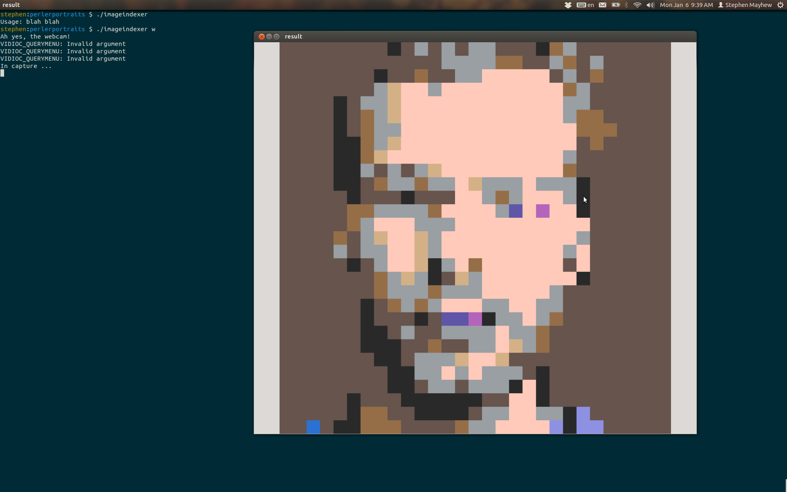

#Perler Portraits.

The goal of this project is to have an automated system for creating portraits from [Perler beads](http://www.amazon.com/Perler-Beads-000-Count-Bucket-Multi/dp/B0000AW5SU). The idea is that each bead acts as a pixel. Naturally, there is only a small number of colors available. This project maps images into the color space allowed by the perler beads. 

There is included a very small file called [palette.png](palette.png). This is the palette from ther perler beads. Any image can serve as a palette, but if it is too large the algorithm will be unreasonably slow. Also, it is best if no two pixels have the same color.

Fair warning: this algorithm is quite slow. This is just a first pass - and since perler boards tend to be pretty small (29x29), speed is not a concern.

It is largely written in C++ using Opencv.

## Usage
```
>  cmake .
>  make
>  ./imageindexer w
>  ./imageindexer krogers.jpg
```

## Webcam Screenshot
The webcam version grabs a square from the middle of the video frame, scales it to 29x29 pixels, and indexes the small image by the palette. 


## Image Conversion
Below is an example of a photo mapped to the perler bead color space. 


